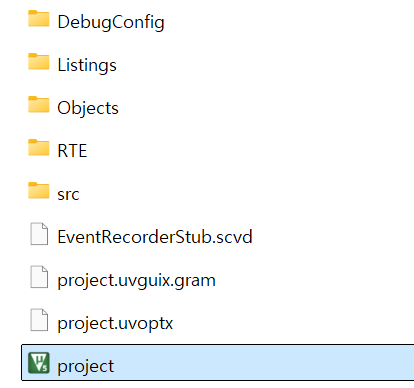
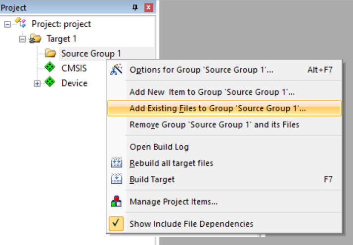
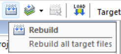
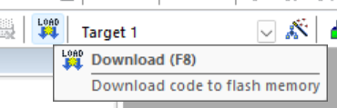

# STM32F103RB Microcontroller Project
This repository contains a project that utilizes the STM32F103RB microcontroller. The following features have been implemented:
- Interrupts
- General Purpose Inputs/Outputs (GPIOs)
- Timers and Counters 
- Universal Synchronous Asynchronous Reciever and Transmitter (USART2)
-  Direct Memory Access (DMA) and Analog-to-digital Conversion (ADC)

## Prerequisites
### Development Tool
- Keil µVision5
### Materials
- 2 x STM32 Nucleo-F103RB
- 4×4 key matrix
- 2 x 8x8 dot matrix display
- TMP36 (temperature sensor)
### Hardware Connections
**TX module**
- 4x4 key matrix
    |Keypad pin no.|C1|C2|C3|C4|R1|R2|R3|R4|
    |:---|:---:|:---:|:---:|:---:|:---:|:---:|:---:|:---:|
    |**GPIO port**|PB8|PB9|PB10|PB11|PC8|PC9|PC10|PC11|
**RX module**
- 8x8 dot matrix display
    - Row
        |Row no. (pin no.)|1(9)|2(14)|3(8)|4(12)|5(1)|6(7)|7(2)|8(5)|
        |:---|:---:|:---:|:---:|:---:|:---:|:---:|:---:|:---:|
        |**GPIO port**|PC0|PC1|PC2|PC3|PC4|PC5|PC6|PC7|
    - Column (left display)
        |Col no. (pin no.)|1(13)|2(3)|3(4)|4(10)|5(6)|6(11)|7(15)|8(16)|
        |:---|:---:|:---:|:---:|:---:|:---:|:---:|:---:|:---:|
        |**GPIO port**|PB8|PB9|PB10|PB11|PC8|PC9|PC10|PC11|
    - Column (right display)
        |Col no. (pin no.)|1(13)|2(3)|3(4)|4(10)|5(6)|6(11)|7(15)|8(16)|
        |:---|:---:|:---:|:---:|:---:|:---:|:---:|:---:|:---:|
        |**GPIO port**|PB7|PB6|PB5|PB4|PB3|PB2|PB1|PB0|
- TMP36
    |Pin (pin no.)|+Vs(1)|Vout(2)|GND(3)|
    |:---|:---:|:---:|:---:|
    |**GPIO pin no. (port)**|18(+5V)|32(PA4)|20(GND)|
**USART (communication)**
- Connect GPIO ports: PA9 of the TX module to PA10 of the RX module.
- Connect GND pins of the STM32 Nucleo-F103RB boards.

## Getting Started
1. Open the project.
    {: width='35%', height='35%'}
2. Add source files for Tx or RX module.
    {: width='50%', height='50%'}
3. Connect STM32 Nucleo-F103RB and build the project.
    {: width='20%', height='20%'}
4. Download the project to the board.
    {: width='30%', height='30%'}

## Specification
The program developed in this project receives a key input from the TX module. The TX module transfer the key to the RX module. The RX module deal with the request by the key.
### Hardware Operation
- Key matrix layout:
    |K|E|Y||
    |-|-|-|-|
    |0|1|2|3|
    |4|5|6|7|
    |8|9|*|#|
    |-|-|-|-|
- Display: Two dot matrix displays are arranged side by side to create an 8x16 resolution.

### Default State

- The LED in the top-right corner of the right matrix blinks at short intervals.

### Time and Temperature Display
- **Time**: Updates every second.
- **Temperature**: Samples and saves every 2 seconds.
- When numeric keys are pressed, the time and temperature scroll and display.
    - Time is displayed in the format `hh:mm:ss`.
    - Temperature is displayed in the format `nn.n`.
- If the time is not set, the display blinks.

### Time Setting
- While the time and temperature are displayed, you can set the time by entering the key sequence `*hhmmss*`.
- **Timeout**: If no key input is detected for a short period, it returns to the default state, and the left dot matrix displays ‘T’ for a while.

### Door Lock Function
- **Passcode**: Can be set with 4 to 8 digits.
  
  - **Passcode Entry**:
      - Enter in the format `#nnnnnn#`. The numbers being entered are displayed scrolling on the dot matrix.
      - **Timeout**: If no key input is detected for a while, it returns to the default state, and the left dot matrix displays ‘T’ for a short time.
      - **Unlock**: When the entered passcode matches the stored passcode, it returns to the default state, and the left dot matrix displays ‘O’ for a short time.
      - **Wrong Passcode**: When the entered passcode does not match the stored passcode, it returns to the default state, and the left dot matrix displays ‘X’ for a short time.
      - **Passcode Entry Failed 3 Times**: If the passcode is entered incorrectly three times in a row, it returns to the default state, and the left dot matrix displays ‘D’ for a short time. The door lock function will be disabled after this.

- **Passcode Setting**:
    - Press and hold `#` to set the passcode.
    - During passcode setting, the left dot matrix displays ‘P’, and the continuously entered numbers are displayed scrolling on the dot matrix, similar to time setting.
    - After entering the passcode, press `#` to save it.
    - **Timeout**: If no key input is detected for a while, it returns to the default state, and the left dot matrix displays ‘T’ for a short time.